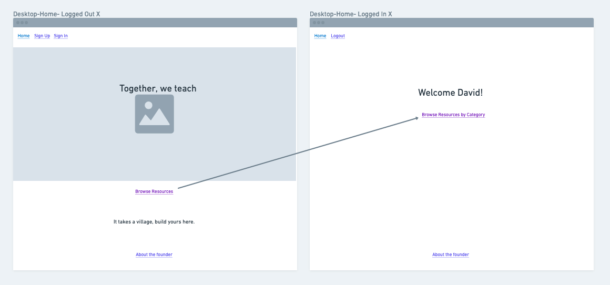

# 🍎 [we_teach](http://weteach.surge.sh/ "we teach and learn together") 🌎

## Description 
we_teach is an app for online educators to teach and learn from one another.  Users create an account and can immediately start adding resources and gleaning experiences and tips from one another about online teaching*.

## 1️⃣ Phase 1 MVP 
*This is only phase 1 of a larger collaboration project with a group of NYC public school teachers to create multiple products with one purpose:  Creating, sharing, and iterating on our online pedagogical practices within a supportive community of teachers and learners.

### Must have
* User auth
* Unified styling ([React Material UI](https://material-ui.com/getting-started/installation/ "material UI"))
* Full CRUD operation for the teaching resources table. 

## 🌟 Phase 1 Post-MVP

### Should have 
* Previews of resources
* Read operations for the pedagogical categories table. 
### Could have
* A first-time site visitor experience
* Social media aspects similar to posts and likes

## Wireframes




### Component Hierarchy:

```
App.js
  |__ SignUp/SignIn
  |__ Home
  |__ ResourcesIndex
    |__  Resources CRUD

```

### Entity Relationship Diagram


### Helper Functions

| Function | Description |
| :---: | :---: | 
| createResource | creates resource with user_id reference in db by gathering user input and current user data from frontend| 
| login/verify/registerUser | various forms of touching base with the db and adding/confirming the token in user's local storage. | 


### 😁 Code Showcase
```
const sortedResources = 
resources.sort((a, b) => (a.name.toLowerCase() > b.name.toLowerCase()) ? 1 : -1);
//this sorts the resources at mount and after all CRUD actions so the resources on the page are showing in abc 
order by title at all times.
```
```
def password_complexity
    return if password.blank? || password =~ /(?=.*?[A-Z])(?=.*?[a-z])(?=.*?[0-9])(?=.*?[!#'@%$&-])/

    errors.add :password, "Complexity requirement not met. Please use at least: 1 uppercase, 1 lowercase, 1 digit and 1 special character(!#'@%$&-)"
  end
  # Password complexity check on the backend.  Regexp extracted from https://stackoverflow.com/questions/19605150/regex-for-password-must-contain-at-least-eight-characters-at-least-one-number-a
```
### ✔️ Issues and Resolutions

* Using MUI props in a form in conjunction with other components.  Resolution was switching components that needed MUI props to function components and keeping state lifted to the top-most component and passing down as props.

### 📦 Technologies used:

FrontEnd:

- react js
- react router dom
- js, html, css
- react material-ui
- flexbox and grid

Backend:

- bcrypt
- jwt
- cors

Testing:

- byebug + pry
- pretty print

<br></br>

### 👩‍💻 Steps to get your backend up and running: 

* Ruby version: ruby 2.6.4

* Configuration:

  Make sure you have rails and bundle installed.
  1. `cd` into the repo 
  2. `bundle`
</br>

* Database creation
  3. `rails db:create`
</br>

* Database initialization
  4. `rails db:migrate`
  5. `rails db:seed` 
</br>

* How to run the test suite (there is currently no test suite for this app)
</br>

* Deployment instructions
 1.  Normal heroku deployment, except that there is an environment variable used for securing the authentication with a secret key, check out  `application_controller.rb` to see that.  


### ✏️ Steps to get your frontend up and running 

In the client directory, you can run:

##### `yarn start` or `npm start`

Runs the app in the development mode.<br />
Open [http://localhost:3000](http://localhost:3000) to view it in the browser.

The page will reload if you make edits.<br />
You will also see any lint errors in the console.

##### `yarn test`

Launches the test runner in the interactive watch mode.<br />
See the section about [running tests](https://facebook.github.io/create-react-app/docs/running-tests) for more information.

##### `yarn build`

Builds the app for production to the `build` folder.<br />
It correctly bundles React in production mode and optimizes the build for the best performance.

The build is minified and the filenames include the hashes.<br />
Your app is ready to be deployed!

See the section about [deployment](https://facebook.github.io/create-react-app/docs/deployment) for more information.

### Server-side routes
- POST '/auth/login', to:'authentication#login' 
- GET '/auth/verify', to:'authentication#verify'
- GET '/categories/:category_id, 'categories#index'
- POST  /resources resources#create
- GET   /resources resources#index
- POST  /resources resources#create
- GET   /resources/:id resources#show
- PUT    /resources/:id resources#update
- DELETE /resources/:id resources#destroy
- GET    /categories categories#index
- POST   /categories categories#create
- GET    /categories/:id categories#show
- PATCH  /categories/:id categories#update
- PUT    /categories/:id categories#update
- DELETE /categories/:id categories#destroy
- GET    /categories/:category_id/resources/:id resources#add_category
- GET    /categories categories#index
- GET    /categories/:id categories#show
- GET    /users users#index
- POST   /users users#create
- GET    /users/:id users#show
- PATCH  /users/:id users#update
- PUT    /users/:id users#update
- DELETE /users/:id users#destroy


### Time estimates (Phase 1️⃣)

| Component | Priority | Estimated Time | Actual Time |
| --- | :---: |  :---: | :---: | 
| TOTAL | --> | 32hrs| 21.5 hrs | 
| Developing data model | H | 3hrs| 1 hr |
| Build out API | H | 3hrs| 5 hrs |
| Figuring out MUI | H | 3hrs| 6 hrs |
| Adding First Component | H | 3hrs| 3hrs |
| First pass styling | H | 3hrs| 3hrs |
| User review | H | 2hrs| .5hrs |
| Iterate on styles | H | 3hrs| 1 hr |
| Adding Additional Components | H | 6hrs| 1 hr |
| Adding Final Phase 1 Component | H | 3hrs| 1 hr |
| Third pass styling | L | 3hrs| 0 hrs |

