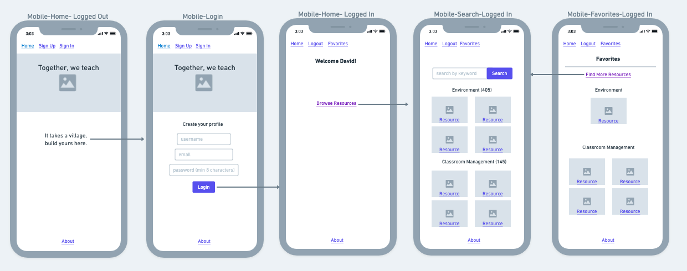

# 🍎 [we_teach](http://weteach.surge.sh/ "we teach and learn together") 🌎

## Description 
we_teach is an app for online educators to teach and learn from one another.  Users create an account and can immediately start gleaning experiences and tips from one another about online teaching*.

## 1️⃣ Phase 1 MVP 
*This is only phase 1 of a larger collaboration project with a group of NYC public school teachers to create multiple products with one purpose:  Creating, sharing, and iterating on our online pedagogical practices in NYC public schools within a supportive community of teachers and learners.

* Must have
 -- User auth
 -- Unified styling ([React Material UI](https://material-ui.com/getting-started/installation/ "material UI"))
 -- Full CRUD operation for the teaching resources table. 
 -- Read operations for the pedagogical categories table. 

## 🌟 Phase 1 Post-MVP

* Should have 
  -- Previews of resources
* Could have
  -- A first-time site visitor experience
  -- Social media aspects similar to posts and likes

## Wireframes




### Component Hierarchy:

```
App.js
  |__ Home
  |__ Search
  |__ Favorites

```

### Entity Relationship Diagram


### 📦 Technologies used:

FrontEnd:

- react js
- react router dom
- js, html, css
- react material-ui
- flexbox

Backend:

- bcrypt
- jwt
- cors

Testing:

- byebug + pry
- pretty print


### Server-side routes
- post '/auth/login', to:'authentication#login' 
- get '/auth/verify', to:'authentication#verify'
- get '/categories/:category_id, 'categories#index'

### SWOT Analysis

| Strengths  | Weaknesses |
| :--- | :--- |
| react, css, and data model designing, frontend routing  | helper function planning  |
| <b>Opportunities</b> | <b>Threats</b> | ------------- | | ------------- |
| testing tools in ruby | rails routes  |

### Time estimates

| Component | Priority | Estimated Time | Actual Time |
| --- | :---: |  :---: | :---: | 
| TOTAL | --> | 40hrs|  | 
| Developing data model | H | 3hrs|  |
| Build out API | H | 3hrs|  |
| Developing data model | H | 3hrs|  |
| Adding First Component | H | 3hrs|  |
| First pass styling | H | 3hrs|  |
| User review | H | 2hrs|  |
| Iterate on styles | H | 3hrs|  |
| Adding 2nd-3rd Component | H | 6hrs|  |
| Adding Final Phase 1 Component | H | 3hrs|  |
| Third pass styling | L | 3hrs|  |


### 👩‍💻 Steps to get your backend up and running: 

* Ruby version: ruby 2.6.4

* System dependencies

* Configuration

* Database creation

* Database initialization

* How to run the test suite

* Services (job queues, cache servers, search engines, etc.)

* Deployment instructions

* ...
### ✏️ Steps to get your frontend up and running 

In the client directory, you can run:

##### `yarn start` or `npm start`

Runs the app in the development mode.<br />
Open [http://localhost:3000](http://localhost:3000) to view it in the browser.

The page will reload if you make edits.<br />
You will also see any lint errors in the console.

##### `yarn test`

Launches the test runner in the interactive watch mode.<br />
See the section about [running tests](https://facebook.github.io/create-react-app/docs/running-tests) for more information.

##### `yarn build`

Builds the app for production to the `build` folder.<br />
It correctly bundles React in production mode and optimizes the build for the best performance.

The build is minified and the filenames include the hashes.<br />
Your app is ready to be deployed!

See the section about [deployment](https://facebook.github.io/create-react-app/docs/deployment) for more information.

##### `yarn eject`

**Note: this is a one-way operation. Once you `eject`, you can’t go back!**

If you aren’t satisfied with the build tool and configuration choices, you can `eject` at any time. This command will remove the single build dependency from your project.

Instead, it will copy all the configuration files and the transitive dependencies (webpack, Babel, ESLint, etc) right into your project so you have full control over them. All of the commands except `eject` will still work, but they will point to the copied scripts so you can tweak them. At this point you’re on your own.

You don’t have to ever use `eject`. The curated feature set is suitable for small and middle deployments, and you shouldn’t feel obligated to use this feature. However we understand that this tool wouldn’t be useful if you couldn’t customize it when you are ready for it.

### Learn More

You can learn more in the [Create React App documentation](https://facebook.github.io/create-react-app/docs/getting-started).

To learn React, check out the [React documentation](https://reactjs.org/).


#### Making a Progressive Web App

This section has moved here: https://facebook.github.io/create-react-app/docs/making-a-progressive-web-app


#### Deployment

This section has moved here: https://facebook.github.io/create-react-app/docs/deployment